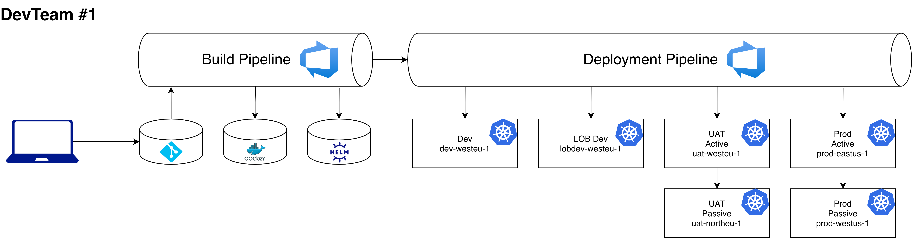

# Description

This is a gitops repo model used by DevTeam1 to fullfil their day to day tasks.

## TL;DR

```bash
kustomize build . | oc apply -f -
```

## Given

DevTeam1 is a regular scrum team which develops micro-services. At the moment team owns 20 different micro-services, but only two a listed for demo purposes:

* cloudprober
* metrics-app

Team's services deployed to few numespaces, but only two listed for demo purposes:

* acm-poc-devteam1
* acm-poc-devteam1-other

Micro-services are packaged into Docker containers and deployed with Helm charts.

At the moment, per environment/cluster application parameters are handled by Delivery Pipeline

### Current Delivery Flow



1. Developer merges his/her branch to master
1. Merge starts build pipeline which:
    * creates artifact
    * packages artifact into docker container
    * creates a helm release for the new docker image
1. Triggers deployment pipeline
1. Deployment pipeline sequentially release new version to environments:
    * `Dev`
    * `LOB Dev` - first release to internal customers
    * `UAT` - active and passive regions deployed in parallel
    * `Production` - active and passive regions deployed in parallel

## Tasks

* Model gitops repository structure for DevTeam1
* Integrate ACM GitOps flow into DevTeam1 delivery pipeline

## Requirements

* `acm-poc-devteam1-gitops` repository should be treated, as a set of resources that represent `devteam1` application
* minimise configuration duplications
* maximise configuration inheritance
* suggested configuration overrides

```plain
Base Layer -> Environment Layer -> Cluster Layer
```

* scale this approach to 10 teams following same development practices

## Notes

* In next 6 month `DevTeam1` will be onboarded to 4 new clusters:
  * `uat-eastus-1`
  * `uat-westus-1`
  * `prod-westeu-1`
  * `prod-northeu-1`

### Example of environment/cluster specific parameters

1. DB connection string:
    * `Dev`: db.local
    * `LOB Dev`: db.lobdev.pas.com
    * `UAT Active`: db.active.uat.pas.com
    * `UAT Passive`: db.passive.uat.pas.com
    * `Prod Active`: db.active.prod.pas.com
    * `Prod Passive`: db.passive.prod.pas.com
1. Replica count:
    * `Dev` & `LOB Dev`: 2
    * `UAT` & `Prod`: hpa
1. 3rd party service URL:
    * `Dev` & `LOB Dev`: api.3rdparty.local
    * `UAT`: api.stage.3rdparty.com
    * `Prod`: api.prod.3rdparty.com
